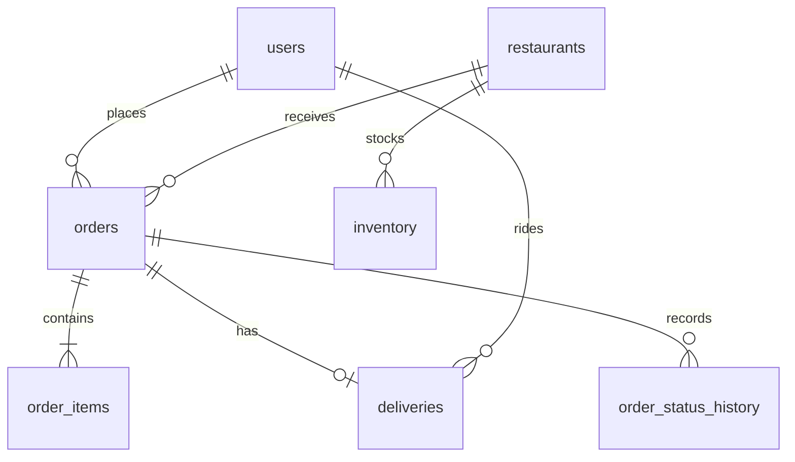

# Initial data model

Migration `0001_order_baseline` creates PostgreSQL `users`, `restaurants`, `inventory`, `orders`, `order_items`, `deliveries`, and `order_status_history`. MongoDB `products`, `rider_locations`, and `location_events` are still owned by catalog and tracking work. Additional columns and indexes must go into new migrations once teammates have applied the baseline.

MongoDB `products.id` must match PostgreSQL `inventory.product_id`. A product can be ordered only when a valid inventory row exists. Creating a product across both databases requires reconciliation for partial writes and a retry path.

The future DDL should include primary keys, foreign keys, unique constraints, check constraints, and indexes for actual queries. MongoDB needs indexes for restaurant catalog queries and current rider locations. Seed scripts must be idempotent and provide at least 1,000 records or documents per database for CP1.

Migrations should be the only executable path for schema changes. A DDL baseline is documentation and must not create the same tables a second time.
